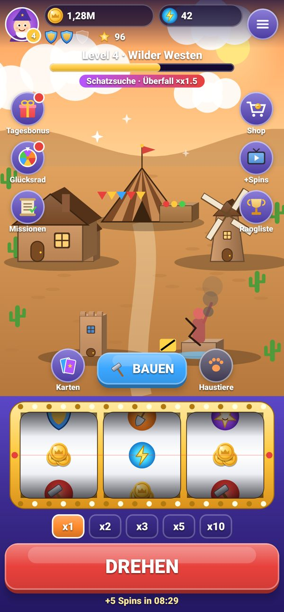
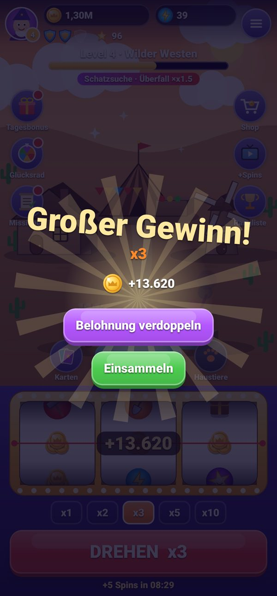
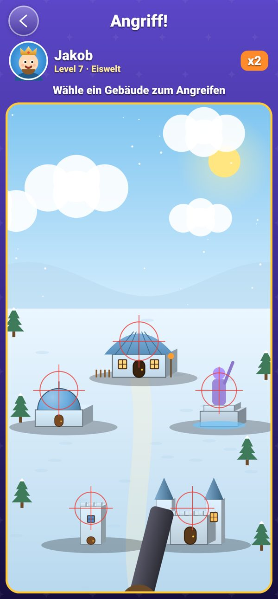
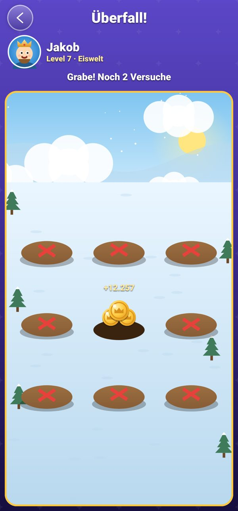
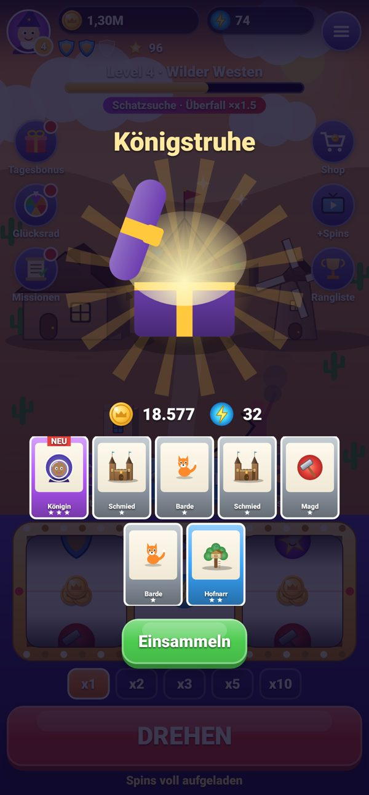
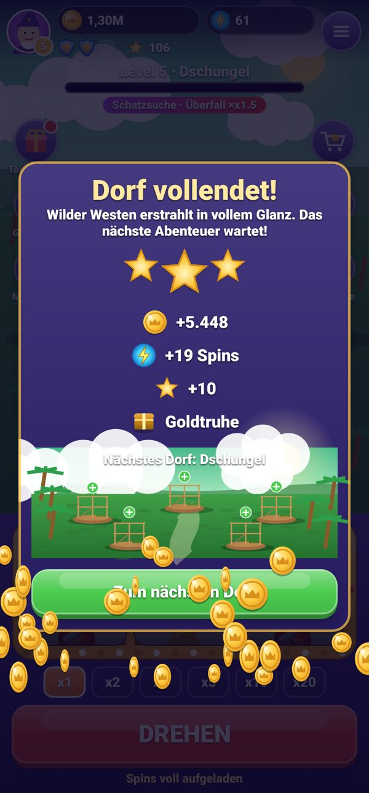
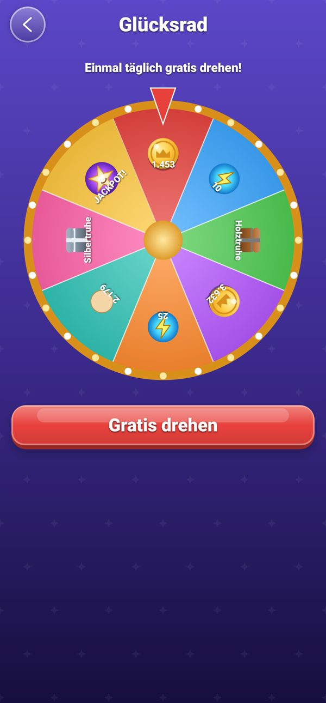
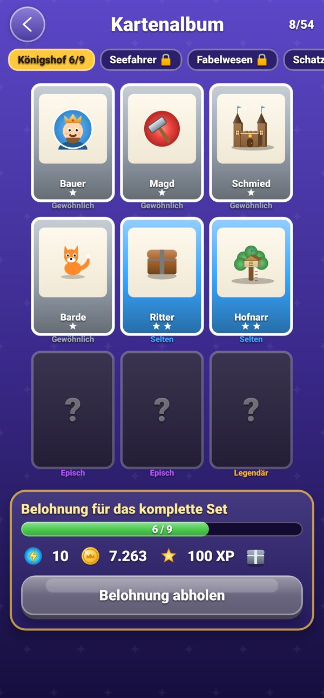

# Spin Kingdom

A native Android slot-and-build game (Kotlin + Jetpack Compose). The UI is **German by default**, with English, Polish, French and Spanish also available. It works fully offline, has no WebView, no ads SDK, no tracking, and uses no real money.

<p>
 
 
 
 
</p>

All screenshots are rendered from the real Compose UI by Robolectric tests (`app/src/test/.../ui`).

## Features
- **Slot machine**: 3 reels with the symbols coins, attack, raid, shield, energy, treasure chest and joker (wild).
  - Triples, pairs and single coins all pay out.
  - Multipliers are x1, x2, x3, x5 and x10. x20 unlocks at level 5, x50 at level 10 and x100 at level 20.
  - A multiplier uses that many spins.
  - x30 unlocks at level 15. A rare, time-limited **"Glücks-Einsatz"** boost unlocks x20 and x30 early for 10 minutes. It shows a countdown badge and has a cooldown between boosts.
  - **Spin-Jackpot** (rare): 3x Energie can award +20 or +30 extra spins. The daily wheel and royal/legendary chests can also give one occasionally. The chances are in `GameBalanceConfig`.
- **Spins**: you start with 50. You regain +5 every 10 minutes up to 50, computed from timestamps, so it also works offline. Rewards can take you above 50.
- **Villages**: 30 hand-themed villages, with procedural levels up to level 500.
  - Each village has 5 buildings with 5 upgrade stages. Everything is drawn with Compose Canvas.
  - Costs rise progressively. You earn stars for upgrades.
  - Completing a village plays an animation and gives a reward plus a chest.
- **Attacks** on bot villages: cannon, explosion, and shield blocks with a consolation prize.
- **Raids**: 9 dig spots, pick 3.
- **Offline bot attacks** on your village: they are fair, shields block first, and a hit only damages a building, which you can repair.
- **Shields**: 3, rising to 4 at level 15 and 5 at level 30.
- **Pets**: fox, dragon, raccoon and phoenix. They have XP, can be fed treats, and their effects apply in the game logic.
- **Cards**: 6 sets × 9 cards in 4 rarities, with an album and set rewards.
- **Chests**: 5 tiers with animated opening.
- **Daily rewards**: a 7-day daily bonus and a daily wheel, both protected against clock manipulation.
- **Missions**: daily and weekly.
- **Leaderboard** (offline bots) and a **profile** with 8 drawn avatars.
- **Shop**: test purchases only ("Testkauf"). **Rewarded ads** are simulated with a countdown overlay.
- **Settings**:
  - Music, sound effects and vibration toggles.
  - Language.
  - Spins-full reminder via WorkManager.
  - Privacy text, save info, player ID and version.
  - Tapping the version 5 times opens the **debug menu**.
- **Audio**: all sounds and the music loop are synthesized by `tools/gen_sounds.py`.

## Architecture
```
de.danielgrebe.spinkingdom
├── config      GameBalanceConfig, LevelConfig (30 themes + procedural up to 500), EventConfig (assets/events.json)
├── models      serializable save-game model (GameState …)
├── domain      SlotEngine, SpinRegen, ClockGuard, Cards/Pets/Buildings, ChestEngine, repository interfaces
├── game        GameEngine – every game action as a pure function (state in → state + effects out)
├── data        local implementations: bots, leaderboard, FakeBillingRepository, SimulatedAdsRepository
├── storage     DataStore (JSON) save game
├── audio       SoundPool effects + looping music + vibration
├── notifications  WorkManager reminder
├── navigation  Compose NavHost
└── ui          MVVM GameViewModel, screens, Canvas drawing, effects
```
- The backend-facing parts (`GameStateRepository`, `OpponentRepository`, `LeaderboardRepository`, `BillingRepository`, `AdsRepository`) are interfaces. You can swap in a server, Firebase, Play Billing or AdMob by changing `AppContainer`.
- To change or schedule events, edit `app/src/main/assets/events.json`. Each event has a date range, optional weekdays, and coin, spin, raid, attack and chest modifiers.
- To disable the debug menu, build with `-Pspinkingdom.debugMenu=false`. This sets `BuildConfig.DEBUG_MENU_ENABLED`.

## Build & test
```
./gradlew testDebugUnitTest     # 103 tests: game logic + Robolectric UI smoke/screenshot tests (PNGs → out/screens)
./gradlew assembleRelease       # unsigned, R8-shrunk release APK
tools/sign-apk.sh app/build/outputs/apk/release/app-release-unsigned.apk out/SpinKingdom-1.0.apk
```
The signing key is **not** in this repository. `tools/sign-apk.sh` looks for it outside the repo.

## CI
The workflow is stored at `ci/android-build.yml`, which is **not** an active location. The token that created this repo did not have the `workflow` scope, so GitHub rejected every write to `.github/workflows/`. To activate CI, run:
```
mkdir -p .github/workflows && git mv ci/android-build.yml .github/workflows/android-build.yml && git commit -m "Enable CI" && git push
```
Pushing this needs a token with the `workflow` scope (`gh auth refresh -s workflow`), or you can do it in the GitHub web UI. The workflow runs the tests, builds the unsigned release APK, and uploads it together with the screenshots and test reports.
